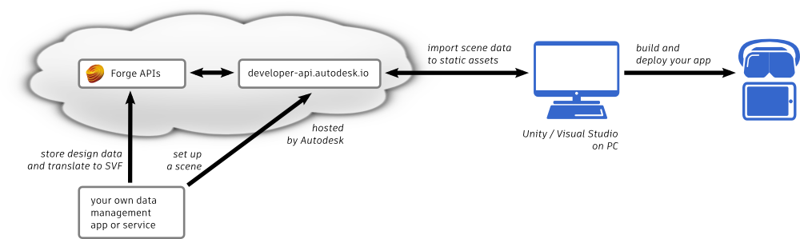
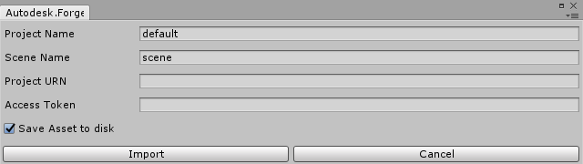

# Concepts

## Before you start

- Register as a Forge developer, if you’re not already! You’ll need to have a good understanding of how to authenticate, and how to use the data management and model derivative APIs.
- Install the latest version of Unity 2017, and set up a new project to work on your device of choice.
- Download the code example that demonstrates how to prepare your Unity scene. You can find this in the **Downloads** area to the left of this page: click **Unity scene preparation sample code**, and download the **test-2legged** file. This bash script shows a minimal sequence of calls to the Forge and developer-api.autodesk.io REST APIs that will get you through Step 1 and Step 2 below.
- If you have problems using the steps on this page to get up and running, please let us know in the User Forums on this site!

## Step 1. Use Forge to prepare an SVF

The Forge AR|VR Toolkit needs your design data to be available in the SVF format produced by the model derivative service. So, in order to get started with this toolkit, you will need to write an app or script that uses the Forge APIs to generate this version of your data. You'll need to:

- Store a data file in the Forge data management service, or figure out how to navigate the hubs, projects, folders and objects in the data management service to access a file stored by a user.
For more information, see the [documentation for the data management API](https://developer.autodesk.com/en/docs/data/v2/overview/).
- Use the Forge model derivative service to convert that data to SVF format. For more information, see the [documentation for the model derivative API](https://developer.autodesk.com/en/docs/model-derivative/v2/overview/).

We recommend starting with smaller files while you're setting up the workflow. Once you have successfully gotten a smaller file all the way through the pipeline and rendering in your app, then consider trying out some larger and heavier scenes.

For the next step, you'll need to take note of a few items of information that identify the data object you want to work with:

- The URN, or objectId, of the data.
- The bucketKey that identifies the bucket where the data is stored in the data management API.

This information is returned by the data management API when you upload a new object or query for information about an existing object.

If you need to use three-legged authentication to reach a data file that was saved by a particular user account, you'll also need:

- The project_id and version_id of the object.

## Step 2. Set up a scene

In this step, you'll create a new scene definition for your SVF on the developer-api.autodesk.io server, and start a translation job that extracts the viewable data from that SVF and prepares it for Unity. To do this, you'll need to write an app or script that invokes a series of REST API endpoints provided by the developer-api.autodesk.io server.

In all of these calls, you must set the Authorization header to a valid OAuth token that you obtained from the Forge authentication API. Note that this token must grant the right to access the data file that you want to use.

Note also that when you call the following endpoints, you **must** convert the urn value into a **URL-safe Base64 encoding**. If you've already used the model derivative API, you should be familiar with how to generate this already. The scene_id value should also be URL-encoded, but does not need to be Base64.

- Create a new scene definition for your data.  
For 2-legged authentication, call the PUT /arkit/v1/{urn}/scenes/{scene_id} endpoint.  
For 3-legged authentication, call the PUT /data/v1/projects/{project_id}/versions/{version_id}/scenes/{scene_id} endpoint.  

    + **urn**: The objectId of the data file you want to use, as given to you by the Forge data management service.
    + **scene_id**:  A descriptive name for your scene that you can decide for yourself.
    + project_id: and version_id For 3-legged authentication to user data files, you will need these ID values. They are also given to you by the Forge data management service.  
    
    You need to send to this endpoint a JSON payload that contains a prj object with the following fields:  

    + **bucketKey**: The bucket key of your data file in the Forge data management API.
    + **objectId**:  The plain-text URN or objectId of your file in the Forge data management API.
    + **urn**: the URL-safe Base64-encoded version of the objectId string above, exactly as it appears in the endpoint URL.

    For example:
    ```
    payload=" \
    { \
        \"prj\": { \
            \"bucketKey\": \"${bucket}\", \
            \"objectId\": \"${id}\", \
            \"urn\": \"${urn}\" \
        } \
    }"
    response=$(curl -X PUT \
    -H "Authorization: ${bearer}" \
    -H "Content-Type: application/json" \
    "https://developer-api.autodesk.io/arkit/v1/${urn}/scenes/my_scene_id" \
    -d "${payload}" \
    -k -s)
    ```
  
- With the scene definition in place, you can start a scene processing job. This tells the developer-api.autodesk.io server to get the SVF data prepared by the model derivative service, and to process its viewable data into scene assets.  
Call the **POST /modelderivative/v2/arkit/job** endpoint.  
You will need to send it a JSON payload that contains both the URL-safe Base64-encoded URN and the scene ID you set up above.

    For example:
    ```
    payload=" \
    { \
        \"input\": { \
            \"urn\": \"${urn}\" \
        }, \
        \"output\": { \
            \"formats\": [ \
                { \
                    \"type\": \"arkit\", \
                    \"scene\": \"${scene_id}\" \
                } \
            ] \
        } \
    }"
    response=$(curl -X POST \
    -H "Authorization: ${bearer}" \
    -H "Content-Type: application/json" \
    "https://developer-api.autodesk.io/arkit/v1/modelderivative/v2/arkit/job" \
    -d "${payload}" \
    -k -s)
    ```
 

- The developer-api.autodesk.io server starts its scene processing job in response to your request, and continues processing asynchronously. To know when the processing is done and your scene assets are ready to use, you'll need to try to retrieve a manifest. If you're familiar with the Forge model derivative API,you'll recognize this pattern.  
Call the **GET /modelderivative/v2/arkit/{urn}/manifest** endpoint.  
This call returns a JSON object that contains a derivatives array. When all of the objects in this array have their progress field set to complete, the job is done and the scene is ready to be loaded by Unity.  

    For example:
    ```
    progress="pending"
    while [ "${progress}" != "complete" ]; do
        sleep 5
        response=$(curl -X GET \
            -H "Authorization: ${bearer}" \
            -H "Content-Type: application/json" \
            "https://developer-api.autodesk.io/modelderivative/v2/arkit/${urn}/manifest" \
            -k -s)
        status=$(echo $response | jq --raw-output .derivatives[-1].status)
        progress=$(echo $response | jq --raw-output .derivatives[-1].progress)
        echo "Request: ${status} (${progress})"
    done
    ```

For details on all the endpoints provided by the developer-api.autodesk.io server, see:

[https://app.swaggerhub.com/apis/cyrillef/forge-ar_kit/1.0.0](https://app.swaggerhub.com/apis/cyrillef/forge-ar_kit/1.0.0)

## Step 3. Install the Unity package

You'll need to add to your Unity project a package of new assets that communicate with the developer-api.autodesk.io to bring into Unity the scene assets you created for your design data.

1. Click the **Downloads** area to the left, then **Unity data pipeline project assets**. Download the *.unitypackage* archive to your computer.
2. Choose **Assets > Import Package > Custom Package** from the main menu bar of the Unity editor.
3. Browse to and select the *.unitypackage* file you downloaded, and click **Open**.
4. You'll be shown a preview of all the assets in the package. Click **Import** to bring them all into your project.

In the Unity editor, you should see some new folders listed in your **Project** tab: *Forge, ForgeSamples, Plugins, Resources*, and *SimpleJSON*.

## Step 4. Set up the Unity scene

1. Create a new, empty GameObject in your scene.  
Select GameObject > Create Empty from the main menu. Make sure your new GameObject is selected in the Hierarchy panel.

2. Add the Forge Loader script component to your GameObject.   
In the Inspector panel, click Add Component. Select Scripts > Autodesk.Forge.ARKit > Forge Loader.

3. In the property list for the Forge Loader component: 
    - Set the **URN** property to the URL-safe Base64-encoded URN of your model in the Forge data management service.
    - Set the **SCENEID** property to the name of the scene you created on the developer-api.autodesk.com server in step 2 above.
    - You'll need to set up the **BEARER** property too. See the next section for details.
    - The **Processed Nodes** and **Processing Nodes Completed** event lists are optional. They allow you to monitor the progress of the loader's download task and respond when its download is complete.  
    The **Processed Nodes** event fires each time the ForgeLoader completes downloading a new item in the scene. It is passed a number between 0 and 1 that indicates what percentage of the download task has been completed so far. In the sample scenes, this event is used to show a UI canvas, and to update the value of a slider.  
    The **Processing Nodes Completed** event fires once, when the download task is done. In the sample scenes, this event is used to hide the UI canvas and the slider when all parts of the model have been downloaded.

    <p align="center">
    
    </p>

4. Save your scene.

## Step 5. Set up Forge authentication for your Unity app

When your ForgeLoader script component connects to the developer-api.autodesk.com server, it needs to prove that it has the right to access the scene data that it's requesting. In order to do that, you need to set it up with a valid Forge authentication token.

It's your responsibility to set up its BEARER property with a valid Forge access token.

- For the purposes of getting started with this toolkit's data pipeline, you can authenticate with the Forge authentication API, retrieve the access_token returned by the service, and paste that value directly into the variable value. However, keep in mind that this token will be time-limited.
- You could consider making your Unity app authenticate with the REST API of the Forge authentication service on startup. For an example of how you could set this up, and a script component that you could re-use in your own scene, see the **Assets > Forge Samples > loadWith2legged.unity** scene.

Note that for security reasons we strongly recommend not putting your app ID or secret directly into your Unity code, especially if you anticipate releasing your app publicly.
- A possible solution could be to read your app ID and secret from a settings file or environment variables. Or, if you're building an AR app, you could embed your credentials in a QR code that you only give out to authorized users, and have your app scan the code before attempting to download the data.
This part of the Unity app is currently up to you to design and build, as it depends on the kind of experience you're trying to build on top of your data, and whether you need two-legged or three-legged authentication to Forge.

## Step 6. Deploy and test

Run your scene in the Unity editor, or build and run your game on your target platform. You should see your Forge model appear in your scene as the viewable parts of the scene are loaded:
<p align="center">
  
</p>


## Sample projects

The .unitypackage file that you installed includes some sample scenes that demonstrate different ways of using the ForgeLoader script component.

**Assets > ForgeSamples > loadAtStartup.unity**

This sample shows a simple GameObject that loads a model into the game, much like you set up in the process above. It also uses the Processed Nodes and Processing Nodes Completed events on the ForgeLoader script component to drive a slider, showing the current progress of the download.

To use this sample:

1. Select the LoadAtStartup game object in the Hierarchy panel.
2. In the Inspector, set up the URN, SCENEID and BEARER values with your own information.

**Assets > ForgeSamples > loadWith2legged.unity**

This sample builds on **loadAtStartup.unity** above, but doesn't require you to set the **BEARER** token for your ForgeLoader component by hand. Instead, it offers a new script component (**Scripts > Autodesk.Forge.ARKit > Commands**) that acquires a token from the Forge authentication API, and passes that token to the ForgeLoader component.

To use this sample:

1. Select the Loader game object in the Hierarchy panel.
2. In the Inspector, set up the URN and SCENEID values with your own information. Leave the BEARER blank.
3. Open the Assets/Forge/ARKit/ForgeLoaderConstants.cs file in Visual Studio. Replace the values of the FORGE_CLIENT_ID and FORGE_CLIENT_SECRET variables with your own app's ID and secret.

When you run the project, the oAuth object connects to Forge, uses the client ID and secret to obtain a token, and passes that token to the Loader object so that it can retrieve the assets.

**Assets > ForgeSamples > multipleScenes.unity**

This sample builds on **loadWith2legged.unity** above, but provides a UI for the player to choose between different scenes that you set up for a given resource URN.

To use this sample:

1. Select the Loader game object in the **Hierarchy** panel.
2. In the **Inspector**, set up the **URN** value with your own information. Leave the **BEARER** and **SCENEID** blank.
3. Open the Assets/Forge/ARKit/ForgeLoaderConstants.cs file in Visual Studio. Replace the values of the FORGE_CLIENT_ID and FORGE_CLIENT_SECRET variables with your own app's ID and secret.
4. You'll want to go back to Step 2 up near the top of this page, and ask the developer-api.autodesk.io service to create additional scene definitions for your model. This time, when you call the PUT endpoint to create each different scene definition, you can make each scene contain different subsets of the items in your model by using the optional list and remove objects to the JSON payload. These filter out which items in the model you want included in the scene.

When you run the project:

1. Click the **Load Scenes button**. This kicks off a request to the developer-api.autodesk.io service to get all available scene definitions for the URN you set in the Loader object.
2. Select the scene you want to load from the Select a Scene drop-down list. You should see your model start downloading in response.

## Bonus option: import models to static assets

We believe that the real-time connection between the Unity app and the on-line design data is one of the most interesting and valuable attributes of the Forge to Unity data pipeline. However, in some cases it may be more convenient for your workflow to import one or more models into your Unity project as local, static assets that are persisted to disk and that get packaged into your project.
<p align="center">
  
</p>

For example:

- You might need to minimize download times in your app.
- You might know that your design data is final and you won't need to take advantage of the ability for your app to pull the latest data from the server.
- You might want to temporarily bring your design data into the Unity scene as a placeholder, so that you can set up the scene around it with lights, set dressing, and particle effects to show it off at its best.
- You might want to add multiple copies of a given asset into the Unity scene. For example, if you want to add set dressing like park benches, trees and lampposts, it will probably be more efficient to import these assets, create prefabs from them, and drop multiple copies of the prefabs around your scene, rather than create multiple separate ForgeLoader objects that all download the same data from Forge.

Note that you can freely combine these approaches within your scene: you could have one or more assets download at runtime from the developer-api.autodesk.io server, and others that you have pre-imported and placed into the scene in the Unity editor.

**To import a model into a static asset**:
<p>
1. Select Forge > Import Asset from the main menu bar in the Unity editor. You'll have to provide some information about the data you want to import:
<p align="center">
  
</p>

- In the **Project URN** field, provide the URL-safe base64-encoded URN of your design data, exactly as you would in the **URN** property of the ForgeLoader component.
- In the **Scene Name** field, provide the name of the scene you created on developer-api.autodesk.io, exactly as you would in the **SCENEID** property of the ForgeLoader component.
- If you need to use three-legged authentication to access your data, also set the data's project ID in the **Project Name** field.
- In the **Access Token** field, paste a valid Forge authentication token.
</p>
2. Click **Import**. Your design data is downloaded from the server and added into the current scene as a new game object.

Next, you may want to create a prefab from this game object, so that you can easily place additional copies into your scene or re-use it in other scenes.

1. In the **Hierarchy** panel, select the new game object.
Select **Forge > Build Prefab** from the main menu bar in the Unity editor.
2. Look for your new prefab under **Assets > Resources**.
3. If you like, you can remove the original downloaded game object from the scene, and replace it with the prefab.

## Next steps

- <p>The user experience of your Unity app on your target platform is totally up to you. The data pipeline offered by the toolkit, and the package of assets that load your scene in from the developer-api.autodesk.io server, intentionally try to avoid constraining the way your app behaves at runtime. So, you'll want to use the Unity editor to add things like user interactions, camera controls, etc.</p>
- <p>The ForgeLoader script component is set up by default to load all the parts of your Forge scene into Unity. If you dig into the code in the Assets/Forge folder, you can see how it calls the services offered by developer-api.autodesk.io to iterate over all the geometry and materials in your scene and bring each into the game world. You can customize this code if you want to change something about this behavior, such as loading only a sub-set of viewable geometry in a scene, or swapping the default materials at runtime for new materials of your own design.</p>
- <p>The developer-api.autodesk.io services are not actually specific to Unity -- they simply provide scene data and geometry in easily parsable JSON formats. Once you understand how to use the server's REST APIs to process and retrieve your scene data, you could get your Forge geometry into a different game engine or application by re-using the same approach used by the scripts in this toolkit's Unity package.</p>

- <p>Let us know about your experience in the User Forums! You'll find them in the **Resources** list on the left of this page.</p>