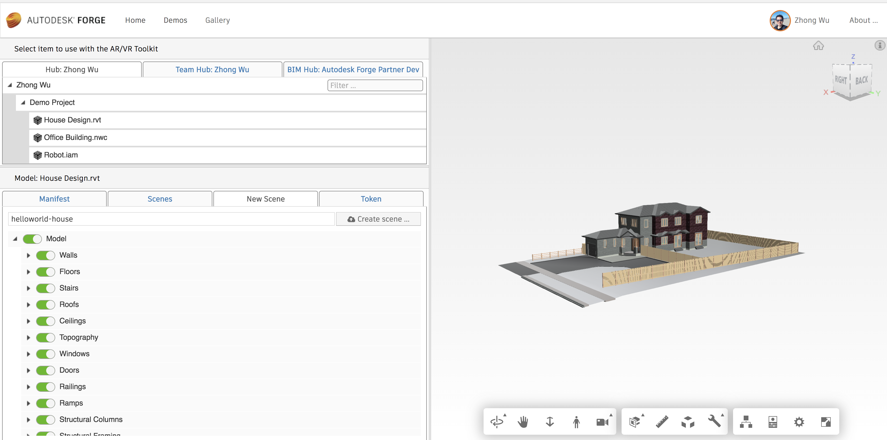

# Hello World

#### Installation

1. Download the latest [Unity Package](unityPackage.md)
2. Open the sample project in Unity at Assets/Forge Samples/LoadAtStartup
3. In a browser, go to [ToolkitService](https://forge-rcdb.autodesk.io/configurator?id=5a2a07e6d72f007fb27b7e0c), login with your Autodesk ID and select an item of design file, for example, 'House Design.rvt'
4. Click 'VR' button, and then create a new Scene called '`helloworld-house`', this is the SceneId
    

    
    

5. Copy the `Urn` and `token` under "Manifest" and Token tabs
6. In Unity, select '`startup Script`' and go to Inspector window, paste in `URN`, `BEARER` (token) and `SCENEID`
    

    
    

7. Now press the Unity '`play`' button

You should now see the following:

  

You can find the original source code for the Unity project under the 'hello world' folder in this github repo.

