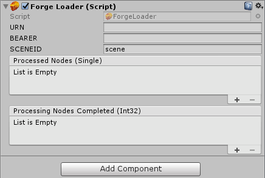

# Query Box Volume

#### Installation

1. [Download the 'queryBox'](CHANGELOG.md) Unity Project
2. open the project in Unity
3. In a browser, go to [ToolkitService](https://forge-rcdb.autodesk.io/configurator?id=5a2a07e6d72f007fb27b7e0c), login and click on the 'house.rvt'
4. create a new Scene called '`helloworld-house`', this is the SceneId
5. Copy the `Urn` and `token` under manifest and token tabs
6. In Unity, select '`startup Script`', and paste in `URN`, `BEARER` (token) and `SCENEID`
    <p align="center">
    
    </p>
7. Now press the Unity '`play`' button

You should now see the following:

<p align="center">
  
</p>

You can find the original source code for the Unity project until the 'hello world' folder in this github repo.


In some games, you might need to hide information from
players. For example, you might not want to reveal the
hands of opponents in card games.

This is easily accomplished at the UI layer (by not
rendering secret information), but the framework also
provides support for not even sending such data to
the client.

In order to do this, use the `playerView` setting in
the `Game` constructor. It accepts a function that
takes `G`, `ctx`, `player` and returns a version of `G`
that is stripped of any secret information for the
player keyed by `player`.

```js
const App = Game({
  ...

  playerView: (G, ctx, playerID) => {
    return StripSecrets(G, playerID);
  }
});
```

In addition to this, you also need to associate clients with
a particular player. The framework is not tied to any particular
authentication system (use anything you wish). Once you have
a mapping from the currently logged in user to a particular
player in a game, use the `player` prop to make the client
aware of this.

```
ReactDOM.render(<App gameID="gameid" player="1" />, document.getElementById('root'));
```

From now on, this client will see state that is customized
for `player "1"`, which is calculated using the `playerView`
function above.

#### PlayerView.STRIP_SECRETS

The framework comes bundled with an implementation of `playerView`
that does the following:

* It removes a key named `secret` from `G`.
* If `G` contains a `players` object, it removes all keys except
  for one that matches `playerID`.

```
G: {
  secret: { ... },

  players: {
    '0': { ... },
    '1': { ... },
    '2': { ... },
  }
}
```

becomes the following for player `1`:

```
G: {
  players: {
    '1': { ... },
  }
}
```

Usage:

```js
import { Game, PlayerView } from 'boardgame.io/core';

const App = Game({
  ...
  playerView: PlayerView.STRIP_SECRETS
});
```
