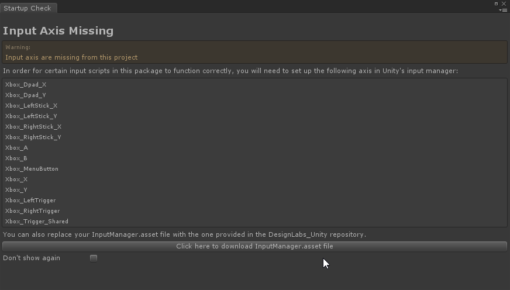
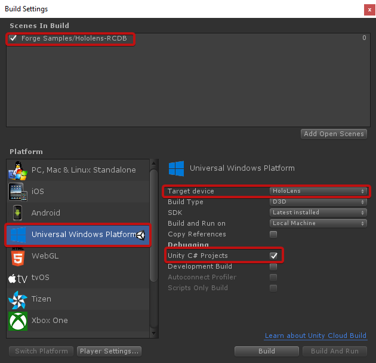

## RCDB sample

This sample is a simple HoloLens demo using [MRLabs](https://github.com/Microsoft/MRDesignLabs_Unity) and the Forge Toolkit.

(if you wonder what RCDB means, Autodesk Forge RCDB: Responsive Connected Database. A cutting edge set of demos featuring Autodesk Forge Viewer and WebServices APIs.)

### Setup

- Get the `ARVRToolkit.unitypackage`
  - You can download the `ARVRToolkit.unitypackage` from the [forgetoolkit web site](http://forgetoolkit.com/)
  - Alternatively you can create a `ARVRToolkit.unitypackage` from the sources in this repository: open the folder `ARVRToolkit\unity-src\ARVRToolkit` in **Unity 2017.3.1f1**, then export package with all assets in the project (for ex) to `ARVRToolkit/unity-src/ARVRToolkit/ARVRToolkit.unitypackage`
- Create a new project in **Unity 2017.1.2f1**. The project must use **Unity 2017.1.2f1** because of its dependency to the [Microsoft MRDesignLabs unitypackage](https://github.com/Microsoft/MRDesignLabs_Unity)
- Go to `Edit > project Settings > Player`. Then in the inspector: `Other settings > Scripting Define Symbols`, add `FORGE_HUX`
- Import `ARVRToolkit/unity-src/ARVRToolkit/ARVRToolkit.unitypackage`
- Import `ARVRToolkit/unity-src/extra-samples/rcdb-HoloLens/MRLabs.unitypackage`, it's a copy of the [Microsoft MRDesignLabs unitypackage](https://github.com/Microsoft/MRDesignLabs_Unity)
  - You will be prompted about `Input Axis Missing` warning
  - 
  - Download the `InputManager.asset` and overwrite the existing file in the `ProjectSettings` folder with this one
- Import `ARVRToolkit/unity-src/extra-samples/rcdb-HoloLens/rcdb-Example.unitypackage`
- In Unity, open `Assets/Forge Samples/Hololens-RCDB`, press play
- Go to `File > Build Settings`, make the changes to match this screenshot
  - 
  - click Build

### Usage

Note, you can emulate the sample directly in the Unity editor if you want to. Just press the 'Play' button, and using gesture or voice commands to run the demo. There is 2 assets burned as prefabs in the demo. You can also use the QR code scanner to connect your HoloLens to a model prepared online with Forge. See instructions below.

Using it real!
After having compiled and deployed the sample on your HoloLens, got to the [Forge RCDB web site](https://forge-rcdb.autodesk.io/configurator?id=5a2b31ee58144b89730d6d5a), and select one of the model. My favorite one is the BB8 mode ;). Next, select the 'Scenes' tab, and a scene in the dropdown. Last, select the 'QR Code' tab, and click on the QR code to make it bigger. On the HoloLens say 'Scan' or click on the 'Scan' button to scan the QR code, and enjoy ;)

#### Voice commands are:

* Menu / Hide Menu: Shows and Hides the toolbar menu
* Scan: Scans a QR Code to load a model prepared on the forge-rcdb website
* Load The Palace: Loads the palace prefab (note this is the [Palais Brongniart](http://www.palaisbrongniart.com/nef.html) in Paris coming from Revit and decimated from 20 millions polygon to just 500k polygons to fits into the HoloLens)
* Load My Car: Loads the car static prefab
* Bigger / Scales Up: Makes the mode bigger
* Smaller / Scales Down: Makes the model smaller
* Normal Size: Restores the size of the model as it was first loaded
* Explode: Breaks the model apart
* Combine: Restores the model in its orginal state after 'Explode'
* Reset: Resets the scene

## License

This sample is licensed under the terms of the [MIT License](http://opensource.org/licenses/MIT). 
Please see the [LICENSE](LICENSE) file for full details.

## Written by

Cyrille Fauvel  
Forge Partner Development  
http://developer.autodesk.com/  
http://around-the-corner.typepad.com  